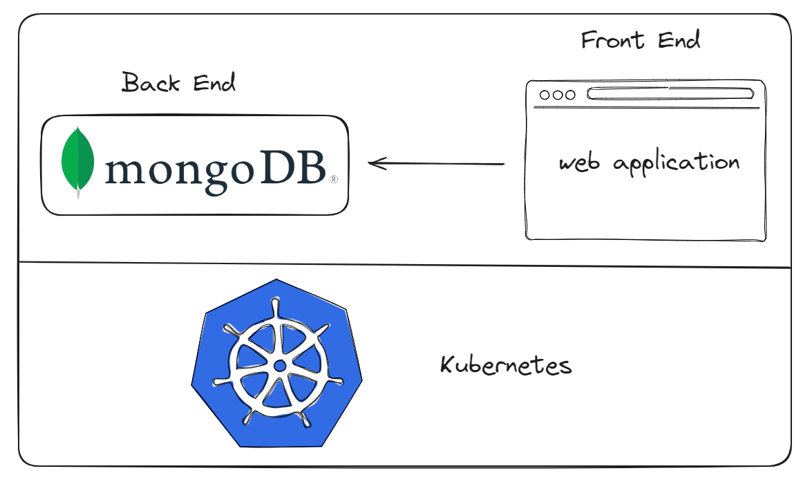
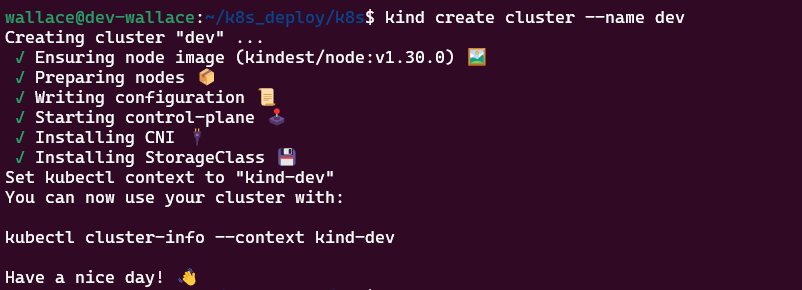
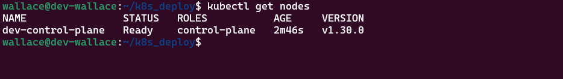
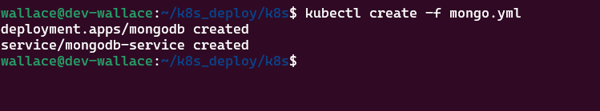
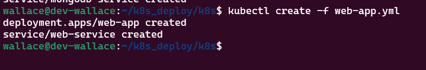
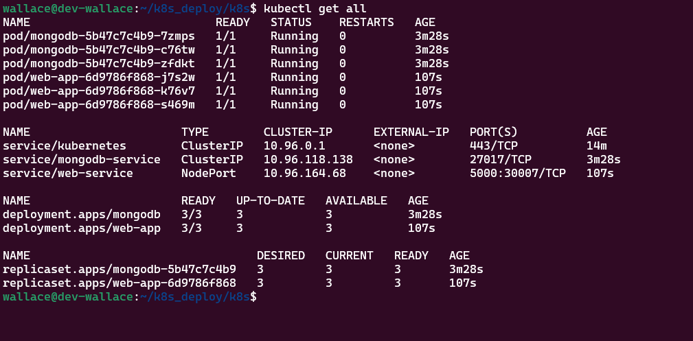
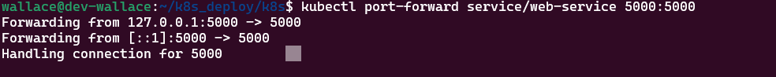
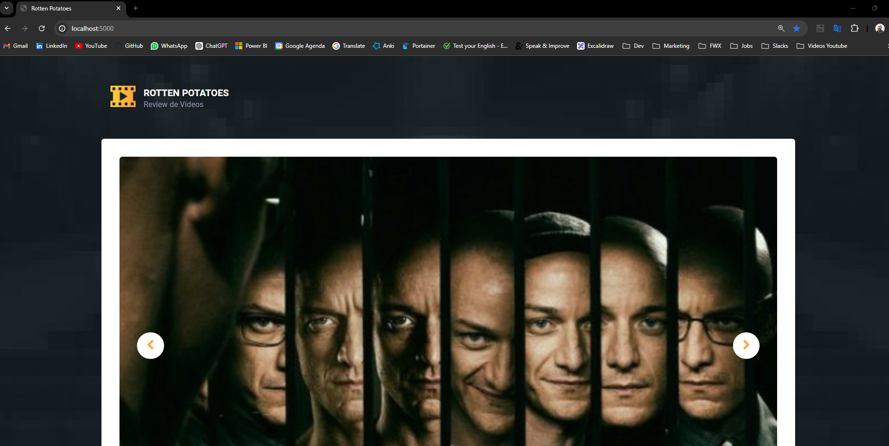

# Deploy no Kubernetes

Simulação de deploy em um cluster Kubernetes local. No meu caso, fiz utilizando o WSL2 (Windows Subsystem for Linux).

## Arquitetura


## Pré-requisitos 
- Instalar o Docker
- Instalar o Kind
- Instalar o kubectl

## Como instalar os pré-requisitos? (com base em Linux)
Docker

https://www.youtube.com/watch?v=pRFzDVn40rw&list=PLbPvnlmz6e_L_3Zw_fGtMcMY0eAOZnN-H

Kind
```
# For AMD64 / x86_64
[ $(uname -m) = x86_64 ] && curl -Lo ./kind https://kind.sigs.k8s.io/dl/v0.23.0/kind-linux-amd64
# For ARM64
[ $(uname -m) = aarch64 ] && curl -Lo ./kind https://kind.sigs.k8s.io/dl/v0.23.0/kind-linux-arm64
chmod +x ./kind
sudo mv ./kind /usr/local/bin/kind
```
kubectl
```
 curl -LO "https://dl.k8s.io/release/$(curl -L -s https://dl.k8s.io/release/stable.txt)/bin/linux/amd64/kubectl"
```

## Steps
### Faça Clone do projeto
```
git clone https://github.com/wlcamargo/k8s_deploy
```
### Acesse a pasta do projeto
```
cd k8s_deploy
```

### Crie um cluster no Kind
```
kind create cluster --name dev
```
sample:


### Verifique os Nodes 
```
kubectl get nodes
```
sample:


### Entre na pasta k8s do projeto 
Nesta pasta contém os manifestos de deploy + services
```
cd k8s
```

### Crie o POD + Service do MongoDB
```
kubectl create -f mongo.yml
```
sample:


### Crie o POD + Service da aplicação Web
```
kubectl create -f web-app.yml
```
sample:


### Verifique se os PODS e Services foram criados
```
kubectl get all
```
sample:


### Faça Port-forward para Acessar pelo navegador
```
kubectl port-forward service/web-service 5000:5000
```
sample:


### Abra o navegador e digite 
```
localhost:5000
```
sample:


### Conclusão
Parabéns! Sua aplicação web já está rodando no Kubernetes.


## Developer
| Desenvolvedor      | LinkedIn                                   | Email                        | Portfólio                              |
|--------------------|--------------------------------------------|------------------------------|----------------------------------------|
| Wallace Camargo    | [LinkedIn](https://www.linkedin.com/in/wallace-camargo-35b615171/) | wallacecpdg@gmail.com        | [Portfólio](https://wlcamargo.github.io/)   |


## References

Fabricio Veronez: https://www.youtube.com/watch?v=gDHmxPlVRZ0&t=6381s

https://kubernetes.io/docs/tasks/tools/install-kubectl-linux/

https://kind.sigs.k8s.io/docs/user/using-wsl2/


